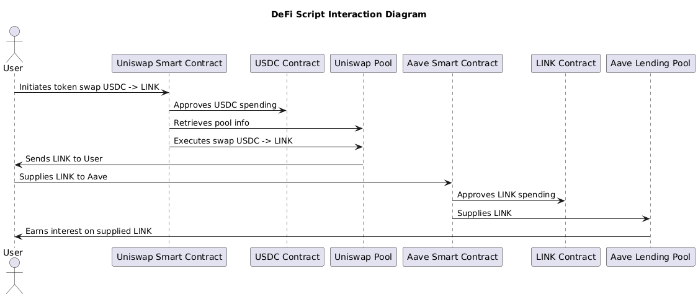

# DeFi Swap and Supply Script

## Overview of Script

This script demonstrates the integration of multiple DeFi protocols, specifically Uniswap and Aave, to execute a more sophisticated financial operation on the Ethereum Sepolia testnet.

### Workflow:

1. **Token Swap on Uniswap:**
   - The script begins by swapping USDC for LINK using Uniswap V3. 
   - It interacts with the Uniswap V3 smart contracts to approve the USDC token, retrieve pool information, and execute the swap. The user receives the equivalent amount of LINK in return.

2. **Supply LINK to Aave:**
   - After the swap is completed, the script supplies the acquired LINK tokens to Aave's lending pool.
   - The script approves the spending of LINK and deposits it into Aave, allowing the user to earn interest on their supplied LINK.

### DeFi Protocols Involved:

- **Uniswap V3:** A decentralized exchange protocol used for swapping tokens without the need for an intermediary.
- **Aave:** A decentralized money market protocol where users can lend and borrow a variety of assets.

This script showcases the composability of DeFi protocols, where assets obtained from one protocol can seamlessly be used in another for additional financial benefits.

## Diagram Illustration

The following diagram illustrates the sequence of steps and interactions between Uniswap and Aave in the script.



- **User Initiates Token Swap:** The user initiates a swap from USDC to LINK on Uniswap.
- **Uniswap Smart Contract:** Manages the approval, pool information retrieval, and execution of the token swap.
- **User Supplies LINK to Aave:** The user supplies the received LINK to Aave for earning interest.
- **Aave Smart Contract:** Handles the approval of LINK spending and its deposit into Aave's lending pool.

This diagram provides a visual representation of how the script interacts with the different protocols to achieve the desired financial operation.


# Code Explanation

## Overview

This section offers a detailed explanation of the code, highlighting key functions, the underlying logic, and how interactions with the DeFi protocols (Uniswap and Aave) are handled.

## Key Functions and Logic

### 1. **approveToken Function**

```javascript
async function approveToken(tokenAddress, tokenABI, amount, wallet) {
  try {
    const tokenContract = new ethers.Contract(tokenAddress, tokenABI, wallet);
    const approveAmount = ethers.parseUnits(amount.toString(), USDC.decimals);
    const approveTransaction = await tokenContract.approve.populateTransaction(
      SWAP_ROUTER_CONTRACT_ADDRESS,
      approveAmount
    );
    const transactionResponse = await wallet.sendTransaction(
      approveTransaction
    );
    console.log("Sending Approval Transaction...");
    console.log(`Transaction Sent: ${transactionResponse.hash}`);
    const receipt = await transactionResponse.wait();
    console.log(`Approval Transaction Confirmed! https://sepolia.etherscan.io/tx/${receipt.hash}`);
  } catch (error) {
    console.error("An error occurred during token approval:", error);
    throw new Error("Token approval failed");
  }
}

